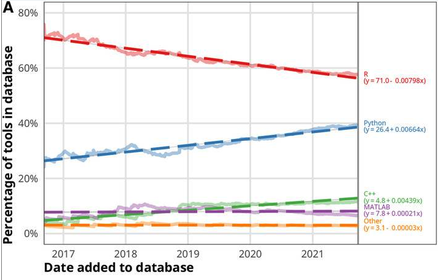
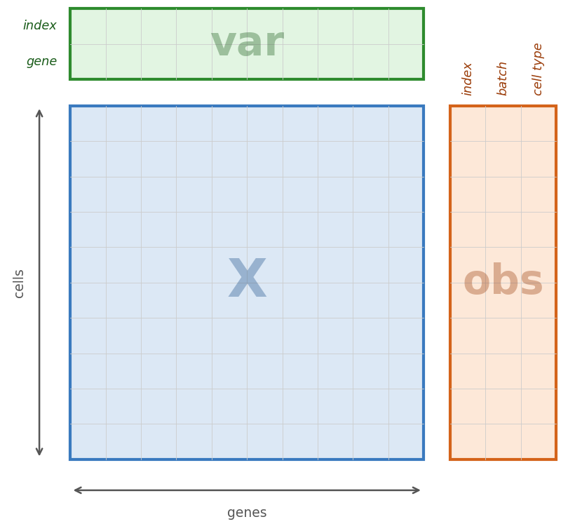
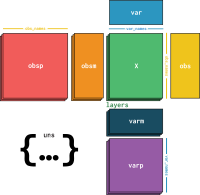

## Objectives & Learning Goals
- Brief overview of tools used in single cell analysis

## Python
- Versatile and popular object oriented programming language
- Expressive & readable syntax
- Extensive library ecosystem 
- Heavily used in data science and machine learning

## R
- Language created for statistical computing
- Extensive library ecosystem for statistical analysis
- Heavily used in bioinformatics and statistics
- Excellent for data visualization

## Python vs R
- R has lead over python for existing statistical analysis libraries
- Python is more popular for machine learning
- Python is more versatile for general programming tasks
- Python scales better to larger datasets

## Python vs R
- Higher rate of growth of Python packages for single cell analysis 

## Python vs R {.smaller}
- Recommendation: 
  - Get comfortable with both
  - R will stay relevant for a long time
  - Python popularity is growing rapidly
    - Particularly in machine learning
- Challenge:
  - Diffierent syntax
    - Its not actually that different
  - Different package ecosystems
    - We have a solution for that
  - Switching between languages
    - We have a solution for that too!

## Conda
- A cross platform package manager developed for Python
- Can install non-python packages as well
- Create isolated environments
- Install packages

## Jupyter
- Interactive notebooks for data analysis
- Can run Python, R, and many other languages
- Supports rich media output
- Great for exploratory data analysis and visualization

## anndata

## anndata
